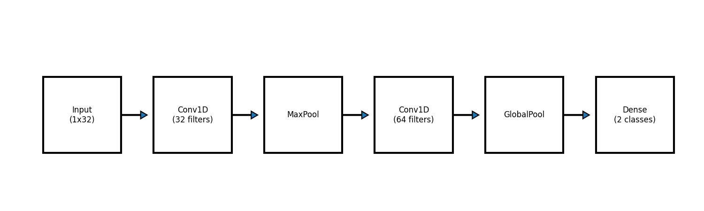
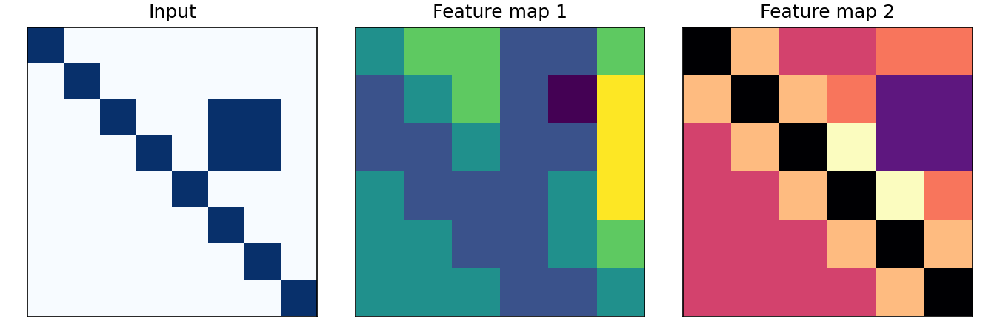
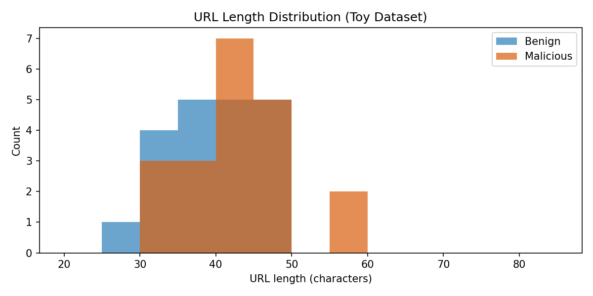

# Convolutional Neural Network (CNN) for Cybersecurity

A convolutional neural network is a deep learning architecture that learns local patterns using small filters that slide over the input. The key ideas are **local receptive fields** and **weight sharing**: each filter looks at a small window and the same weights are reused across positions. This produces translation-invariant features and reduces the number of parameters. CNNs typically alternate convolution layers (feature extraction), non-linear activation functions (like ReLU), and pooling layers (down-sampling), then use dense layers for final classification. Because they can learn hierarchical features, CNNs are powerful for inputs with local structure such as images, byte sequences, URLs, command lines, and log tokens.

In cybersecurity, CNNs are practical because threats often manifest as local patterns. For example, phishing URLs contain suspicious substrings, malware payloads have characteristic byte n-grams, and web logs show repeated token structures. A 1D CNN can scan a character or token sequence and detect these patterns without hand-crafted features. CNNs are fast at inference time and fit well into real-time pipelines such as URL filtering, email triage, and IDS alert enrichment.

---

## Key CNN Components
- Convolution: learns local detectors (filters) that activate on patterns like suspicious substrings.
- Activation: introduces non-linearity to model complex relationships.
- Pooling: reduces sequence length while preserving strong signals.
- Dense layers: combine learned features for classification.

---

## Visualizations
**CNN architecture (1D for text)**


**Example of convolutional feature maps**


**URL length distribution in the toy dataset**


---

## Toy Dataset Summary
| Class | Count | Avg length | Min length | Max length |
| --- | --- | --- | --- | --- |
| Benign | 20 | 39.40 | 28 | 49 |
| Malicious | 20 | 42.65 | 30 | 57 |

This dataset is synthetic for demonstration. It includes typosquatting, deep subdomains, suspicious query strings, IP-based URLs, and path traversal patterns to mimic common phishing behavior.

---

## Toy Dataset (Inline CSV)
```csv
url,label
https://bank.example.com/login,0
https://mail.example.com/inbox,0
https://news.example.com/world,0
https://store.example.com/cart,0
https://university.example.edu/portal,0
https://github.com/user/repo,0
https://docs.example.com/reset-password,0
https://support.example.com/ticket/1234,0
https://company.example.com/hr/policies,0
https://payments.example.com/receipt/2024,0
https://calendar.example.com/events/2024-03-22,0
https://api.example.com/v1/users?id=532,0
https://blog.example.com/security/certificates,0
https://portal.example.com/sso/login?next=%2Fhome,0
https://shop.example.com/products/sku-8831,0
https://status.example.com/incidents/2024-03-10,0
https://cdn.example.com/assets/js/app.bundle.js,0
https://hr.example.com/benefits/enrollment,0
https://docs.example.com/api/authentication,0
https://accounts.example.com/oauth/authorize,0
http://secure-login.example.net/verify,1
http://account-update.example.org/confirm,1
http://paypa1.example.co/login,1
http://bank.example.net/security/verify,1
http://micr0soft.example.net/office365-login,1
http://dropbox.example.org/share/credential,1
http://update.example.net/verify/account,1
http://signin.example.org/confirm/identity,1
http://appleid.example.net/verify,1
http://billing.example.org/urgent/login,1
http://login.example.co@evil.example.ru/confirm,1
http://example.com.security-check.in/validate,1
http://account.example.com.verify.secure-login.cc/reset,1
http://verify-payments.example.info/secure/?session=93847,1
http://cloud-storage.example.xyz/drive/login.php,1
http://sso.example.com.login.auth-update.top/,1
http://secure.example.com-login.verify.evil.biz/,1
http://91.198.174.192/login/verify,1
http://example.com/%2e%2e/%2e%2e/admin/login,1
http://xn--pple-43d.example.com/id/verify,1
```

---

## Python Code (Inline, Includes Data)
```python
import numpy as np
import tensorflow as tf
from tensorflow.keras.preprocessing.sequence import pad_sequences
from tensorflow.keras.layers import Embedding, Conv1D, MaxPooling1D, GlobalMaxPooling1D, Dense, Dropout

# Inline dataset (URL, label)
data = [
    ("https://bank.example.com/login", 0),
    ("https://mail.example.com/inbox", 0),
    ("https://news.example.com/world", 0),
    ("https://store.example.com/cart", 0),
    ("https://university.example.edu/portal", 0),
    ("https://github.com/user/repo", 0),
    ("https://docs.example.com/reset-password", 0),
    ("https://support.example.com/ticket/1234", 0),
    ("https://company.example.com/hr/policies", 0),
    ("https://payments.example.com/receipt/2024", 0),
    ("https://calendar.example.com/events/2024-03-22", 0),
    ("https://api.example.com/v1/users?id=532", 0),
    ("https://blog.example.com/security/certificates", 0),
    ("https://portal.example.com/sso/login?next=%2Fhome", 0),
    ("https://shop.example.com/products/sku-8831", 0),
    ("https://status.example.com/incidents/2024-03-10", 0),
    ("https://cdn.example.com/assets/js/app.bundle.js", 0),
    ("https://hr.example.com/benefits/enrollment", 0),
    ("https://docs.example.com/api/authentication", 0),
    ("https://accounts.example.com/oauth/authorize", 0),
    ("http://secure-login.example.net/verify", 1),
    ("http://account-update.example.org/confirm", 1),
    ("http://paypa1.example.co/login", 1),
    ("http://bank.example.net/security/verify", 1),
    ("http://micr0soft.example.net/office365-login", 1),
    ("http://dropbox.example.org/share/credential", 1),
    ("http://update.example.net/verify/account", 1),
    ("http://signin.example.org/confirm/identity", 1),
    ("http://appleid.example.net/verify", 1),
    ("http://billing.example.org/urgent/login", 1),
    ("http://login.example.co@evil.example.ru/confirm", 1),
    ("http://example.com.security-check.in/validate", 1),
    ("http://account.example.com.verify.secure-login.cc/reset", 1),
    ("http://verify-payments.example.info/secure/?session=93847", 1),
    ("http://cloud-storage.example.xyz/drive/login.php", 1),
    ("http://sso.example.com.login.auth-update.top/", 1),
    ("http://secure.example.com-login.verify.evil.biz/", 1),
    ("http://91.198.174.192/login/verify", 1),
    ("http://example.com/%2e%2e/%2e%2e/admin/login", 1),
    ("http://xn--pple-43d.example.com/id/verify", 1),
]

urls = [u for u, _ in data]
labels = np.array([y for _, y in data], dtype=np.float32)

# Character-level encoding
chars = sorted(set("".join(urls)))
char_to_idx = {c: i + 1 for i, c in enumerate(chars)}

max_len = 80
seqs = [[char_to_idx[c] for c in url] for url in urls]
X = pad_sequences(seqs, maxlen=max_len, padding="post", truncating="post")

# Train/test split (80/20)
rng = np.random.default_rng(42)
indices = rng.permutation(len(urls))
split = int(0.8 * len(urls))
train_idx = indices[:split]
test_idx = indices[split:]
X_train, y_train = X[train_idx], labels[train_idx]
X_test, y_test = X[test_idx], labels[test_idx]

# Simple 1D CNN
model = tf.keras.Sequential([
    Embedding(input_dim=len(chars) + 1, output_dim=16, input_length=max_len),
    Conv1D(32, kernel_size=3, activation="relu"),
    MaxPooling1D(pool_size=2),
    Conv1D(64, kernel_size=3, activation="relu"),
    GlobalMaxPooling1D(),
    Dropout(0.3),
    Dense(32, activation="relu"),
    Dense(1, activation="sigmoid")
])

model.compile(optimizer="adam", loss="binary_crossentropy", metrics=["accuracy"])
model.fit(X_train, y_train, epochs=25, batch_size=4, validation_split=0.2, verbose=0)

loss, acc = model.evaluate(X_test, y_test, verbose=0)
print("Test accuracy:", acc)

# Example prediction
sample = "http://secure-login.example.net/verify"
seq = pad_sequences([[char_to_idx.get(c, 0) for c in sample]], maxlen=max_len, padding="post")
score = model.predict(seq, verbose=0)[0][0]
print("Malicious probability:", score)
```

---

## Why This Matters in Cybersecurity
CNNs learn local patterns that correlate with phishing and malware activity, such as suspicious substrings, strange subdomains, and encoded paths. They are efficient, robust, and easy to deploy, which makes them a solid baseline for many real-time security detection systems.
