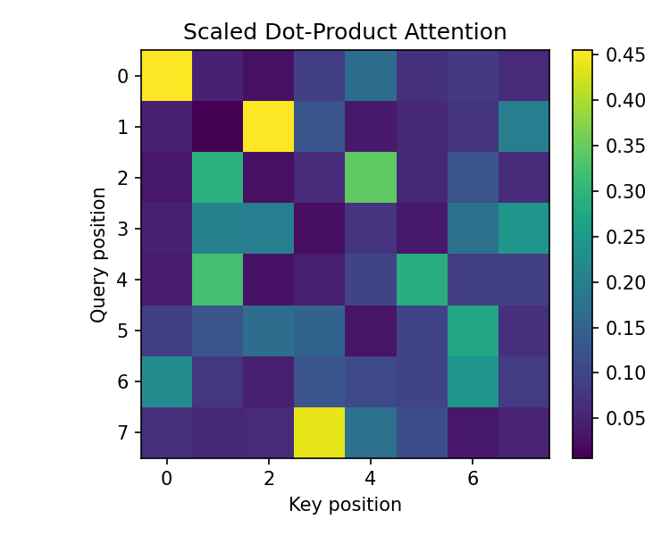
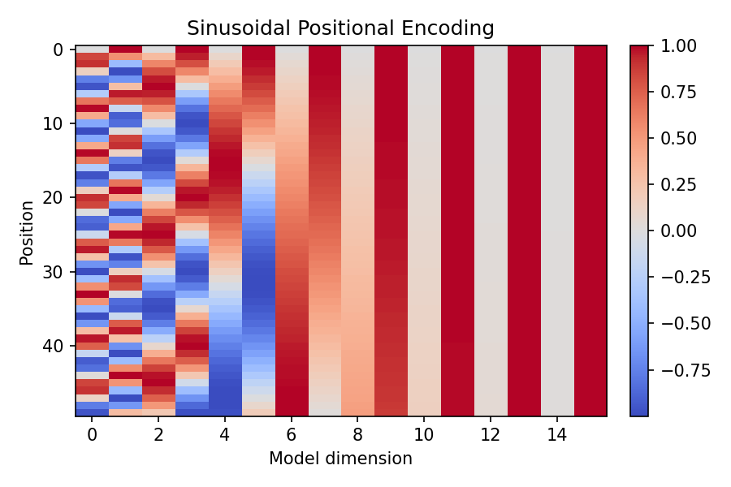

# Transformer Network and Cybersecurity Applications

The transformer is a neural network architecture built around **self-attention** rather than recurrence or convolution. Instead of processing tokens sequentially like an RNN, a transformer processes the entire sequence in parallel and learns how much each token should attend to every other token. This is done with **query, key, and value (Q, K, V)** projections and a scaled dot-product attention mechanism. Multiple attention heads let the model focus on different relationships at the same time, capturing both local and long-range dependencies. This parallelism makes transformers highly efficient on modern hardware and allows them to scale to very large datasets.

Because attention alone does not encode order, transformers use **positional encoding** to inject sequence position information. The classic sinusoidal encoding uses sine and cosine waves of different frequencies, which allows the model to generalize to unseen sequence lengths. The encoder stack learns contextual token representations, while the decoder stack (in encoder-decoder models) produces outputs conditioned on both the input and the generated history. In practice, transformer variants power modern language models and are now common in security analytics.

In cybersecurity, transformers are used for **phishing detection**, **malware family classification**, **log anomaly detection**, **alert triage**, and **incident summarization**. For example, a transformer can read a URL or email text and learn subtle phishing patterns that are hard to handcraft. It can also model sequences of events in authentication logs to identify unusual behavior across time. Large-scale security teams use transformer-based models to prioritize alerts, extract indicators of compromise, and generate human-readable summaries for analysts. While transformers are powerful, they also require careful monitoring for data leakage and adversarial inputs, which are common threats in cyber environments.

---

## Attention Mechanism (Visualization)

## Positional Encoding (Visualization)

---

## Why Transformers Matter for Cybersecurity
Transformers can model complex dependencies and long context windows, which is essential for detecting multi-step attacks or coordinated campaigns. Their flexibility allows them to ingest heterogeneous data such as URLs, scripts, logs, and alerts in a unified framework. As security data grows in volume and complexity, transformers provide a scalable way to learn robust representations directly from raw signals.
