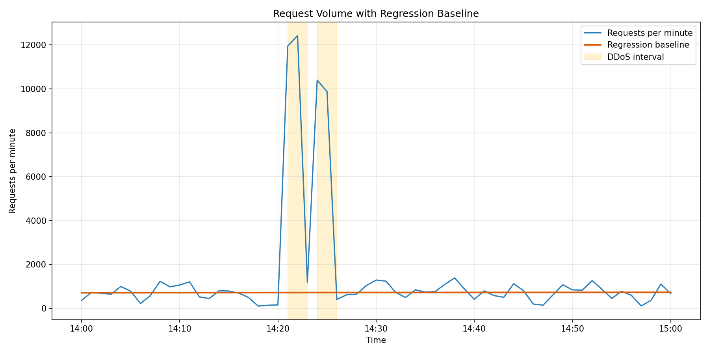
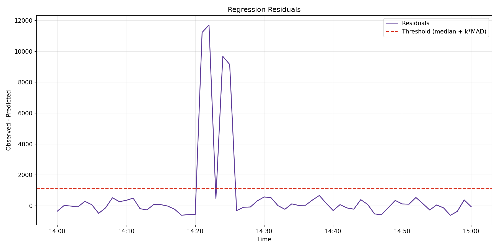

# DDoS Detection Report (Regression Analysis)

**Event log:** [b_batsikadze25_78912_server.log](http://max.ge/aiml_final/b_batsikadze25_78912_server.log)

**Summary**
The log contains 85,650 requests from **2024-03-22 18:00:01+04:00** to **2024-03-22 19:00:59+04:00**. Using a per-minute time series and a linear regression baseline with robust outlier filtering, two short DDoS bursts were detected.

**Detected DDoS Intervals (UTC+04:00)**
| Start | End | Duration (min) | Peak req/min |
| --- | --- | --- | --- |
| 2024-03-22 18:21:00+04:00 | 2024-03-22 18:23:00+04:00 | 2.0 | 12,430 |
| 2024-03-22 18:24:00+04:00 | 2024-03-22 18:26:00+04:00 | 2.0 | 10,399 |

The intervals are reported as **[start, end)** per 1-minute bin; for example, the first burst spans the bins starting at 18:21 and 18:22.

---

## Method (Regression Analysis)
1. Parse timestamps from each log line.
2. Aggregate requests into **1-minute bins** to create a time series of request counts.
3. Fit a **linear regression** model (requests/minute vs. minutes since start) to estimate a baseline.
4. Filter out high-residual outliers and refit the regression (robust to spikes).
5. Compute residuals and mark minutes where residuals exceed **median + 3xMAD**.
6. Merge consecutive flagged minutes into DDoS intervals.

This approach uses regression to model normal traffic and then detects DDoS bursts as large positive residuals.

---

## Regression Details (Explicit)
**Time variable:**  
`t = minutes_since_start`, where `t=0` at **2024-03-22 18:00:00+04:00**.

**Regression equation (final, after outlier filtering):**  
`y = b0 + b1 * t`  
`b0 = 709.6662`  
`b1 = 0.3147`  
So the baseline is:  
`predicted_requests_per_minute = 709.6662 + 0.3147 * t`

**Outlier filtering:**  
Initial regression residuals are used to keep inliers where:  
`residual <= median + 3 * (1.4826 * MAD)`  
Final model is fit on **57 of 61** minute bins.

**Detection threshold (final model):**  
`threshold = median_final + 3 * sigma_final`  
`median_final = 18.0190`  
`sigma_final = 366.3086`  
`threshold = 1116.9449`  
Any minute with `residual > 1116.9449` is flagged as DDoS.

---

## Visualizations
**Requests per minute with regression baseline**


**Residuals with anomaly threshold**


---

## Reproducibility Steps
1. Install dependencies:
   `python3 -m pip install -r requirements.txt`
2. Run the analysis (headless plotting):
   `MPLBACKEND=Agg MPLCONFIGDIR=/tmp/mpl python3 ddos_analysis.py --input ./b_batsikadze25_78912_server --out-dir .`
3. Outputs:
   `ddos_intervals.csv`, `requests_per_minute.png`, `residuals.png`

---

## Main Code Fragments
**1) Timestamp parsing and binning**
```python
LOG_TS_RE = re.compile(r"\[(\d{4}-\d{2}-\d{2} \d{2}:\d{2}:\d{2}[+-]\d{2}:\d{2})\]")

def load_timestamps(path: Path) -> pd.Series:
    timestamps = []
    with path.open("r", encoding="utf-8", errors="ignore") as f:
        for line in f:
            match = LOG_TS_RE.search(line)
            if match:
                timestamps.append(match.group(1))
    return pd.to_datetime(pd.Series(timestamps), format="%Y-%m-%d %H:%M:%S%z").dropna()

counts = (
    timestamps.sort_values()
    .to_frame(name="ts")
    .set_index("ts")
    .resample("1min")
    .size()
)
```

**2) Regression with outlier filtering**
```python
model_initial = LinearRegression().fit(X, y)
pred_initial = model_initial.predict(X)
resid_initial = y - pred_initial

median_initial, sigma_initial = robust_sigma(resid_initial)
inliers = resid_initial <= (median_initial + sigma_k * sigma_initial)

model = LinearRegression().fit(X[inliers], y[inliers])
pred = model.predict(X)
resid = y - pred
```

**3) DDoS interval extraction**
```python
flags = residuals > threshold
intervals = find_intervals(counts.index, flags, "1min")
```

---

## Source Code
#!/usr/bin/env python3
"""DDoS detection via regression analysis on request counts."""

import argparse
import re
from pathlib import Path

import numpy as np
import pandas as pd
from sklearn.linear_model import LinearRegression
import matplotlib
matplotlib.use("Agg")
import matplotlib.pyplot as plt
import matplotlib.dates as mdates

LOG_TS_RE = re.compile(r"\[(\d{4}-\d{2}-\d{2} \d{2}:\d{2}:\d{2}[+-]\d{2}:\d{2})\]")


def load_timestamps(path: Path) -> pd.Series:
    timestamps = []
    with path.open("r", encoding="utf-8", errors="ignore") as f:
        for line in f:
            match = LOG_TS_RE.search(line)
            if match:
                timestamps.append(match.group(1))

    if not timestamps:
        raise ValueError("No timestamps found in log file.")

    series = pd.to_datetime(
        pd.Series(timestamps),
        format="%Y-%m-%d %H:%M:%S%z",
        errors="coerce",
    ).dropna()

    return series


def counts_per_bin(timestamps: pd.Series, bin_size: str) -> pd.Series:
    counts = (
        timestamps.sort_values()
        .to_frame(name="ts")
        .set_index("ts")
        .resample(bin_size)
        .size()
        .rename("count")
    )
    return counts


def robust_sigma(residuals: np.ndarray) -> tuple[float, float]:
    median = float(np.median(residuals))
    mad = float(np.median(np.abs(residuals - median)))
    if mad == 0:
        return median, float(np.std(residuals))
    return median, 1.4826 * mad


def regression_with_outlier_filter(
    counts: pd.Series, sigma_k: float
) -> tuple[np.ndarray, np.ndarray, float, np.ndarray, LinearRegression]:
    x = (counts.index - counts.index[0]).total_seconds() / 60.0
    X = x.to_numpy().reshape(-1, 1)
    y = counts.to_numpy()

    model_initial = LinearRegression().fit(X, y)
    pred_initial = model_initial.predict(X)
    resid_initial = y - pred_initial

    median_initial, sigma_initial = robust_sigma(resid_initial)
    inliers = resid_initial <= (median_initial + sigma_k * sigma_initial)
    if inliers.sum() < 2:
        inliers = np.ones_like(y, dtype=bool)

    model = LinearRegression().fit(X[inliers], y[inliers])
    pred = model.predict(X)
    resid = y - pred

    median_final, sigma_final = robust_sigma(resid[inliers])
    threshold = median_final + sigma_k * sigma_final

    return pred, resid, threshold, inliers, model


def find_intervals(
    index: pd.DatetimeIndex, flags: np.ndarray, bin_size: str
) -> list[tuple[pd.Timestamp, pd.Timestamp]]:
    bin_delta = pd.to_timedelta(bin_size)
    intervals: list[tuple[pd.Timestamp, pd.Timestamp]] = []
    start = None

    for i, is_attack in enumerate(flags):
        if is_attack and start is None:
            start = index[i]
        if start is not None and not is_attack:
            end_idx = index[i - 1]
            intervals.append((start, end_idx + bin_delta))
            start = None

    if start is not None:
        end_idx = index[-1]
        intervals.append((start, end_idx + bin_delta))

    return intervals


def summarize_intervals(
    counts: pd.Series, intervals: list[tuple[pd.Timestamp, pd.Timestamp]]
) -> pd.DataFrame:
    rows = []
    for start, end in intervals:
        window = counts[(counts.index >= start) & (counts.index < end)]
        duration_minutes = (end - start).total_seconds() / 60.0
        peak = int(window.max()) if not window.empty else 0
        rows.append(
            {
                "start": start,
                "end": end,
                "duration_minutes": duration_minutes,
                "peak_requests_per_minute": peak,
            }
        )
    return pd.DataFrame(rows)


def plot_counts(
    counts: pd.Series,
    pred: np.ndarray,
    intervals: list[tuple[pd.Timestamp, pd.Timestamp]],
    output_path: Path,
):
    fig, ax = plt.subplots(figsize=(12, 6))
    ax.plot(counts.index, counts.values, label="Requests per minute", color="#2c7fb8")
    ax.plot(counts.index, pred, label="Regression baseline", color="#d95f0e", linewidth=2)

    added_label = False
    for start, end in intervals:
        ax.axvspan(
            start,
            end,
            color="#fee08b",
            alpha=0.4,
            label="DDoS interval" if not added_label else None,
        )
        added_label = True

    ax.set_title("Request Volume with Regression Baseline")
    ax.set_xlabel("Time")
    ax.set_ylabel("Requests per minute")
    ax.xaxis.set_major_formatter(mdates.DateFormatter("%H:%M"))
    ax.legend(loc="upper right")
    ax.grid(True, alpha=0.3)
    fig.tight_layout()
    fig.savefig(output_path, dpi=150)
    plt.close(fig)


def plot_residuals(
    counts: pd.Series,
    residuals: np.ndarray,
    threshold: float,
    output_path: Path,
):
    fig, ax = plt.subplots(figsize=(12, 6))
    ax.plot(counts.index, residuals, label="Residuals", color="#5e3c99")
    ax.axhline(
        threshold,
        color="#d7301f",
        linestyle="--",
        label=f"Threshold (median + k*MAD)",
    )
    ax.set_title("Regression Residuals")
    ax.set_xlabel("Time")
    ax.set_ylabel("Observed - Predicted")
    ax.xaxis.set_major_formatter(mdates.DateFormatter("%H:%M"))
    ax.legend(loc="upper right")
    ax.grid(True, alpha=0.3)
    fig.tight_layout()
    fig.savefig(output_path, dpi=150)
    plt.close(fig)


def main() -> int:
    parser = argparse.ArgumentParser(description="Detect DDoS intervals using regression analysis.")
    parser.add_argument("--input", required=True, help="Path to event log file")
    parser.add_argument("--out-dir", required=True, help="Output directory")
    parser.add_argument("--bin-size", default="1min", help="Time bin size (default: 1min)")
    parser.add_argument("--sigma-k", type=float, default=3.0, help="Sigma multiplier")

    args = parser.parse_args()
    input_path = Path(args.input)
    out_dir = Path(args.out_dir)
    out_dir.mkdir(parents=True, exist_ok=True)

    timestamps = load_timestamps(input_path)
    counts = counts_per_bin(timestamps, args.bin_size)

    pred, residuals, threshold, inliers, _ = regression_with_outlier_filter(
        counts, args.sigma_k
    )

    flags = residuals > threshold
    intervals = find_intervals(counts.index, flags, args.bin_size)
    summary = summarize_intervals(counts, intervals)

    summary_path = out_dir / "ddos_intervals.csv"
    summary.to_csv(summary_path, index=False)

    plot_counts(counts, pred, intervals, out_dir / "requests_per_minute.png")
    plot_residuals(counts, residuals, threshold, out_dir / "residuals.png")

    print("Detected intervals:")
    if summary.empty:
        print("No intervals detected.")
    else:
        print(summary.to_string(index=False))
    print(f"Saved interval summary to {summary_path}")

    return 0


if __name__ == "__main__":
    raise SystemExit(main())
